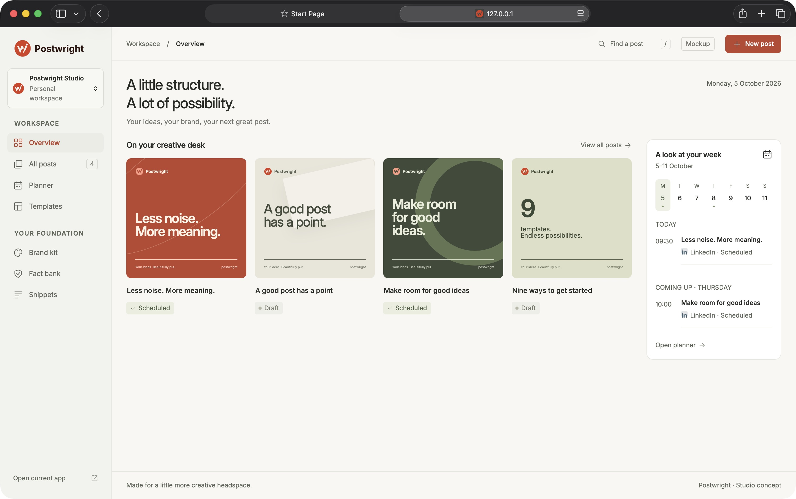

<p align="center">
  <picture>
    <source media="(prefers-color-scheme: dark)" srcset="assets/logo-dark.svg">
    
  </picture>
</p>

<p align="center">
  Make on-brand social posts from templates, check every number against a source, and plan when they go out.
</p>

<p align="center">
  <a href="https://github.com/t1mvdploeg/postwright/actions/workflows/test.yml"></a>
  
  
</p>


Postwright turns a brand into templates: you fill in the text, and layout, colours, fonts and logo follow. Before a post can be scheduled, a brand check reads it, including whether every number in it is backed by a fact with a source.

It runs on your own computer: no account, nothing to host.

## Quick start

You need Node 22.2 or later.

```bash
npm install
npm start
```

Open `http://127.0.0.1:4173` and choose **Add sample content** on the Overview to see three example posts. Your work is saved as JSON files in `./data`; set `POSTWRIGHT_DATA_DIR` to keep it elsewhere and `PORT` to use another port.

## Frontend concept

With the app running, open [the interactive studio mockup](http://127.0.0.1:4173/mockup/index.html). It includes an overview, post library, planner, templates, brand kit, fact bank, snippets, settings, and a live editor. Sample changes stay in memory for the current tab; reloading restores the examples. The SVG download is a simplified concept export.

Browse [every page in the selected style](http://127.0.0.1:4173/mockup/pages.html), then open a screen to try its interactions. The template gallery includes all nine template types.

Compare [four dashboard directions](http://127.0.0.1:4173/mockup/directions.html): the current warm studio, a compact focus desk, a calendar-first planner, and a dark creative studio. The comparison links to each full-size design.



## What it does

- **Templates.** Nine templates: statement, question and answer, steps, statistic, product image, carousel, link preview, LinkedIn profile banner and company cover. Each one comes in the formats it suits, ten in all, from a LinkedIn square to an Instagram story.
- **Brand check.** Text that runs out of its box, contrast below WCAG, banned words, too many hashtags, a missing alt text, and any number without an active fact behind it. The editor blocks scheduling while the check has errors; the rest are points of attention.
- **Facts and snippets.** A fact bank with a source and optional end date per claim, and a snippet bank for openers, closers and hashtags.
- **Planning.** A week list and a month view with ideas, scheduled posts and recurring moments, campaigns with UTM tags, and a calendar export (`.ics`).
- **Export.** PNG or JPEG per format, a ZIP with every format and the captions, and a PDF for a LinkedIn carousel.

## AI writing help

Writing help suggests captions and headlines, and the planner suggests post ideas for a period. Without an API key you get sample answers, clearly marked, so you can try everything for free.

To use Claude, start with your key in the environment:

```bash
ANTHROPIC_API_KEY=sk-ant-... npm start
```

The key is read from the environment only, and never written to a file, sent to the browser or logged. The default model is `claude-sonnet-5-5` (set `POSTWRIGHT_MODEL` to change it), and a monthly spending cap in Settings ($10 by default, checked before each call, per UTC month) stops live calls once reached. Every call is counted in `data/ai-usage.jsonl`.

## Use your own brand

The built-in brand is Postwright's own, in `src/web/brand/`. To use yours, put a `brand.json` with your colours, font and logos in `data/projects/<slug>/brand/` (one brand per project), with the files next to it, using the built-in one as the example. An invalid file is reported with the field that is wrong. Posts made with an earlier brand version still open, and the brand check flags them.

## How it works

The browser does the drawing. A template is a small module that turns fields into HTML and CSS. The preview shows it in a sandboxed iframe, and the export draws the same HTML onto a canvas through an SVG `foreignObject`, so preview equals export. The server is a small Node http server that stores posts, lists and settings as JSON files and talks to the Claude API. It listens on `127.0.0.1` only. There is no build step: plain ES modules in the browser and TypeScript on the server through `tsx`.

`npm test` runs 388 tests, among them a leak check on every tracked text file that fails on a local path, an e-mail address or an API key.

## What it does not do

- It does not post for you: you export and upload; the planner shows what is due.
- No accounts, no team features, no hosting. It is a tool for one computer.
- Export is tested in Chrome. Older Safari versions refuse to export a canvas with an SVG `foreignObject`; you get a message instead.

## Licence

MIT, see [LICENSE](LICENSE). The Inter typeface is under the SIL Open Font License, see [`src/web/brand/fonts/OFL.txt`](src/web/brand/fonts/OFL.txt).
