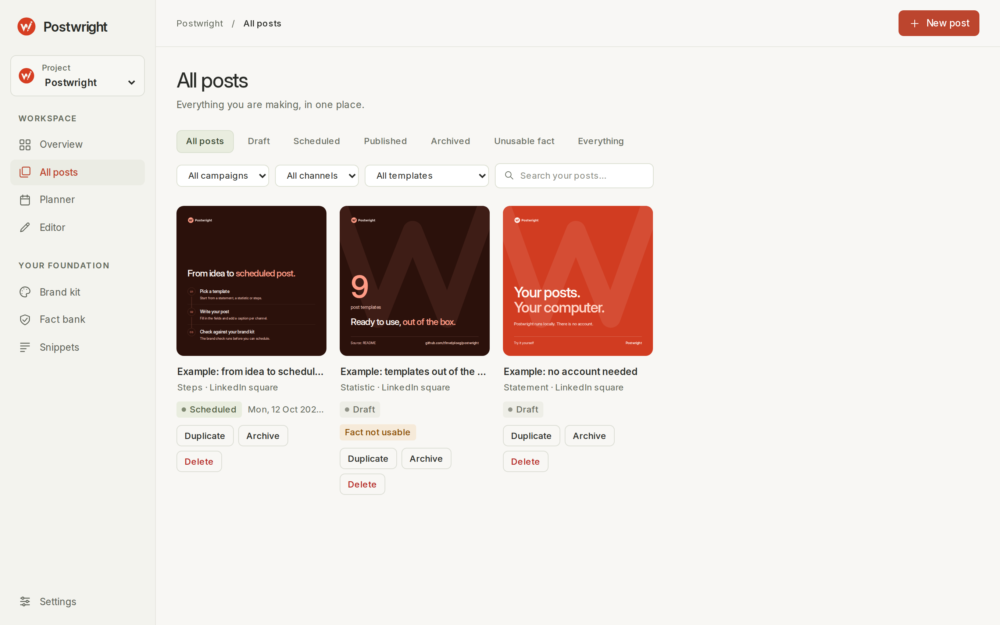

<p align="center">
  <picture>
    <source media="(prefers-color-scheme: dark)" srcset="assets/mark-dark.svg">
    
  </picture>
</p>

<h1 align="center">Postwright</h1>

<p align="center">
  On-brand social posts from templates, with every number checked against a source.
</p>

<p align="center">
  <a href="https://github.com/t1mvdploeg/postwright/actions/workflows/test.yml"></a>
  
  
</p>


Postwright turns a brand into templates. You fill in the words; layout, colours, fonts and logo follow. Before a post can be scheduled, a brand check reads it, down to whether every number in it is backed by a fact with a source. No account, nothing to host.

## Quick start

You need Node 22.2 or later.

```bash
npm install
npm start
```

Open `http://127.0.0.1:4173` and choose **Add sample content** on the overview for three example posts. Your work is saved as JSON files in `./data`; set `POSTWRIGHT_DATA_DIR` to keep it elsewhere and `PORT` to use another port.

## A look around

<table>
  <tr>
    <td width="50%"><br><b>Overview.</b> The posts on your desk, the week ahead, and what needs attention.</td>
    <td width="50%"><br><b>Editor.</b> Fields on the left, the post exactly as it will be exported, and the brand check with the caption.</td>
  </tr>
  <tr>
    <td width="50%"><br><b>All posts.</b> Every post as artwork, filtered by status, campaign, channel or template.</td>
    <td width="50%"><br><b>Brand kit.</b> Identity, colours with contrast, typography and tone, and the place to make a new kit.</td>
  </tr>
</table>

## What it does

- **Templates.** Nine of them: statement, question and answer, steps, statistic, product image, carousel, link preview, LinkedIn profile banner and company cover. Each comes in the formats it suits, ten in all, from a LinkedIn square to an Instagram story. Your own come on top (see below).
- **Brand check.** Text that runs out of its box, contrast below WCAG, banned words, too many hashtags, a missing alt text, and any number without an active fact behind it. Errors block scheduling; the rest are points of attention.
- **Facts and snippets.** A fact bank with a source and an optional end date per claim, and a snippet bank for openers, closers and hashtags.
- **Planning.** Weeks and months, campaigns with UTM tags, and a calendar export (`.ics`).
- **Export.** PNG or JPEG per format, a ZIP with every format and the captions, and a PDF for a LinkedIn carousel.
- **Projects.** One project per brand, each a full workspace of its own: posts, facts, snippets, campaigns, ideas, images and settings. Switch with the picker at the top of the sidebar. A post cannot link to a fact from another project.

## Make a brand kit

On the **Brand kit** screen, upload a logo (SVG, or a PNG with a transparent background) and, if you have them, up to eight images, a brand guide as PDF, font files, the website address and a few notes. Then pick a route:

- **Generate with Claude.** One click, with an API key (see below); the studio proposes colours, grounds with checked contrast, eight logo variants and a font. It takes a few minutes and costs from a few tens of cents to about a dollar.
- **Download the prompt.** No API cost: run the `.md` file in Claude Code or Codex from the Postwright folder, then choose **Check for a proposal**. The prompt assumes the default `data` folder.

Either way you see the proposal first, with a sample post on each ground. **Use this brand kit** applies it; the previous kit is kept once as `brand-previous`, and posts made with it are flagged by the brand check. To check a proposal from the command line, run `npm run brand:check -- <project>`.

You can also write a brand by hand: a `brand.json` with the files next to it in `data/projects/<project>/brand/`, with the built-in brand in `src/web/brand/` as the example.

## Make your own templates

On the **Templates** screen, give the studio screenshots of old posts (up to six), the text of some posts and a short brief, and choose single image or carousel and the formats. **Generate with Claude** proposes a template in your brand (estimated at 10 to 50 cents, not yet measured; counted towards the cap); without an API key it gives a fixed sample so you can try the screen. Or **Download the prompt**, run it in Claude Code or Codex, and check for the proposal; `npm run template:check -- <project>` checks it from the command line. You see the proposal in every format with the brand check before you keep it. A kept template sits next to the built-in ones in the editor, Convert, the library filter and the planner, and can be renamed or deleted.

## AI writing help

Writing help suggests captions and headlines, and the planner suggests post ideas for a period. Both use the company profile in **Settings** (what you do, sector, offer, audience, region) to stay on topic; numbers still come only from your facts. Without an API key you get sample answers, clearly marked, so you can try everything for free. To use Claude, start with your key in the environment:

```bash
ANTHROPIC_API_KEY=sk-ant-... npm start
```

The key is read from the environment only: never written to a file, sent to the browser or logged. Writing help uses `claude-sonnet-5-5` and the brand kit `claude-opus-5-5` (change them with `POSTWRIGHT_MODEL` and `POSTWRIGHT_BRAND_MODEL`). One monthly spending cap in Settings, shared by all projects ($10 by default, per UTC month), is checked before each call. Every call is counted in `data/ai-usage.jsonl`.

## How it works

The browser does the drawing. A template is a small module that turns fields into HTML and CSS; the preview shows it in a sandboxed iframe, and the export draws the same HTML onto a canvas, so preview equals export. The server is a small Node http server on `127.0.0.1` only, which stores everything as JSON files and talks to the Claude API. There is no build step: plain ES modules in the browser, TypeScript on the server through `tsx`. A built-in template is code; one of your own is data (fields, a tree of elements and some CSS) that a single validator checks before it is ever drawn: no scripts, no remote loads, no colours outside the brand.

```bash
npm test            # 993 tests, among them a leak check on every tracked file and a phone-width check in Chrome
npm run typecheck
npm run format:check
```

The studio's look, warm paper with clay as the one accent, is described in [DESIGN.md](DESIGN.md). It follows the system's dark mode and works on a phone. In the editor, Ctrl+S or ⌘S saves.

## What it does not do

- It does not post for you: you export and upload, and the planner shows what is due.
- No accounts, no team features, no hosting. It is a tool for one computer.
- Export is tested in Chrome. Older Safari versions refuse to export a canvas with an SVG `foreignObject`; you get a message instead.

## Licence

MIT, see [LICENSE](LICENSE). The Inter typeface is under the SIL Open Font License, see [`src/web/brand/fonts/OFL.txt`](src/web/brand/fonts/OFL.txt).
