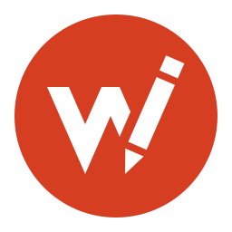
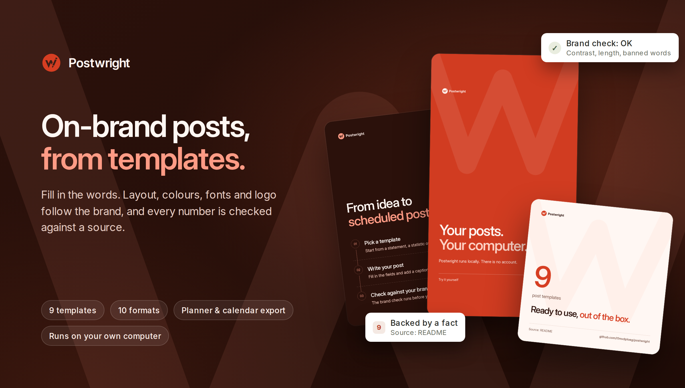
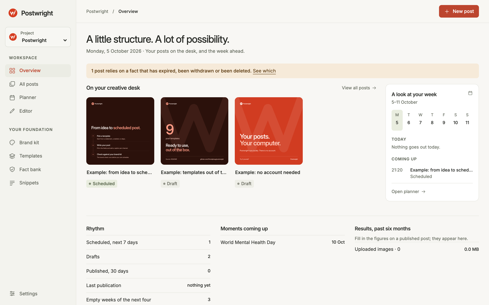
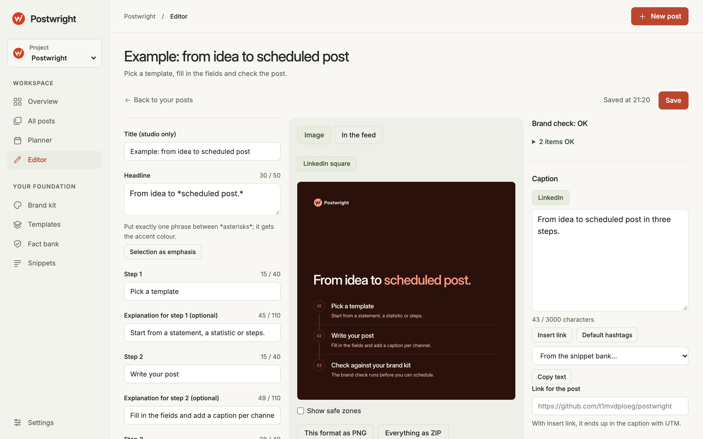
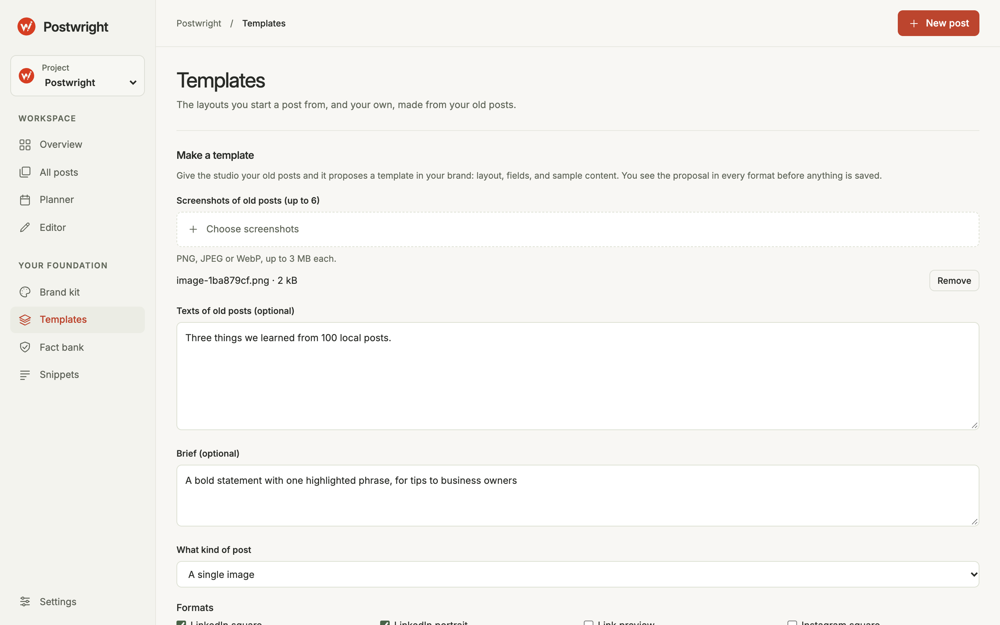
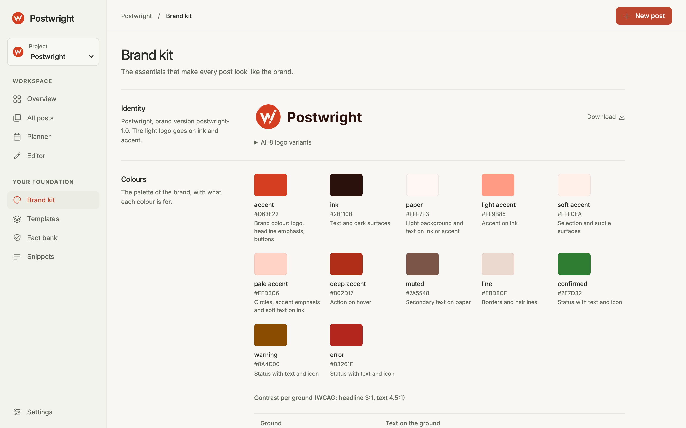

<p align="center">
  <picture>
    <source media="(prefers-color-scheme: dark)" srcset="assets/mark-dark.svg">
    
  </picture>
</p>

<h1 align="center">Postwright</h1>

<p align="center">
  On-brand social posts from templates, with every number checked against a source.
</p>

<p align="center">
  <a href="https://github.com/t1mvdploeg/postwright/actions/workflows/test.yml"></a>
  
  
</p>



Postwright turns a brand into templates. You fill in the words; layout, colours, fonts and logo follow. Before a post can be scheduled, a brand check reads it, down to whether every number in it is backed by a fact with a source. No account, nothing to host.

## Quick start

You need Node 22.2 or later.

```bash
npm install
npm start
```

Open `http://127.0.0.1:4173` and choose **Add sample content** on the overview. Your work is saved as JSON files in `./data`; set `POSTWRIGHT_DATA_DIR` to keep it elsewhere and `PORT` to use another port.

<table>
  <tr>
    <td width="50%"><br><b>Overview.</b> The posts on your desk and the week ahead.</td>
    <td width="50%"><br><b>Editor.</b> Fields, the post exactly as it will be exported, the brand check and the caption.</td>
  </tr>
  <tr>
    <td width="50%"><br><b>Templates.</b> Old posts in, a new template in your brand out.</td>
    <td width="50%"><br><b>Brand kit.</b> Identity, colours with contrast, typography and tone.</td>
  </tr>
</table>

## What it does

- **Templates.** Nine built in, from a statement to a carousel and a LinkedIn banner, in ten formats from a LinkedIn square to an Instagram story. Plus your own, made from your old posts.
- **Brand check.** Text that runs out of its box, contrast below WCAG, banned words, a missing alt text, and any number without an active fact behind it. Errors block scheduling.
- **Facts and snippets.** A fact bank with a source and an optional end date per claim, and reusable openers, closers and hashtags.
- **Planning.** Weeks and months, campaigns with UTM tags, AI ideas for a period, and a calendar export (`.ics`).
- **Export.** PNG or JPEG per format, a ZIP with every format and the captions, and a PDF for a LinkedIn carousel.
- **Projects.** One per brand, each a full workspace with its own posts, facts, templates, company profile and settings.
- **Everywhere.** Light and dark mode, and it works on a phone.

## Let Claude do the groundwork

Three things can be made with Claude, with an API key. The brand kit and templates also have a free route: **Download the prompt** and run it in Claude Code or Codex. Without a key, the studio gives clearly marked sample answers, so every screen can be tried for free.

- **A brand kit** from your logo, images, brand guide, fonts and website: colours with checked contrast, eight logo variants and a font. A few tens of cents to about a dollar.
- **Your own templates** from screenshots and texts of old posts and a short brief, as a single image or a carousel. Estimated at 10 to 50 cents; not yet measured with a real key.
- **Writing help and ideas**: captions, headlines and post ideas, kept on topic by the company profile in Settings.

You always see a proposal before anything is applied. Numbers in AI text must come from your facts. One monthly spending cap, $10 by default, is checked before every call, and every call is counted in `data/ai-usage.jsonl`. The key is read from the environment only:

```bash
ANTHROPIC_API_KEY=sk-ant-... npm start
```

## How it works

The browser does the drawing. A template turns fields into HTML and CSS; the preview shows it in a sandboxed iframe and the export draws the same HTML onto a canvas, so preview equals export. A built-in template is code. One of your own is data: fields, a tree of elements and some CSS, which one validator checks before it is ever drawn: no scripts, no remote loads, no colours outside the brand. The server is a small Node server on `127.0.0.1` that stores JSON files and talks to the Claude API. No build step.

```bash
npm test            # unit tests, a leak check on every tracked file, and a phone-width check in Chrome
npm run typecheck
npm run format:check
```

The design is described in [DESIGN.md](DESIGN.md).

## What it does not do

- It does not post for you: you export and upload, and the planner shows what is due.
- No accounts, no team features, no hosting. It is a tool for one computer.
- Export is tested in Chrome. Older Safari versions refuse to export a canvas with an SVG `foreignObject`; you get a message instead.

## Licence

MIT, see [LICENSE](LICENSE). The Inter typeface is under the SIL Open Font License, see [`src/web/brand/fonts/OFL.txt`](src/web/brand/fonts/OFL.txt).
